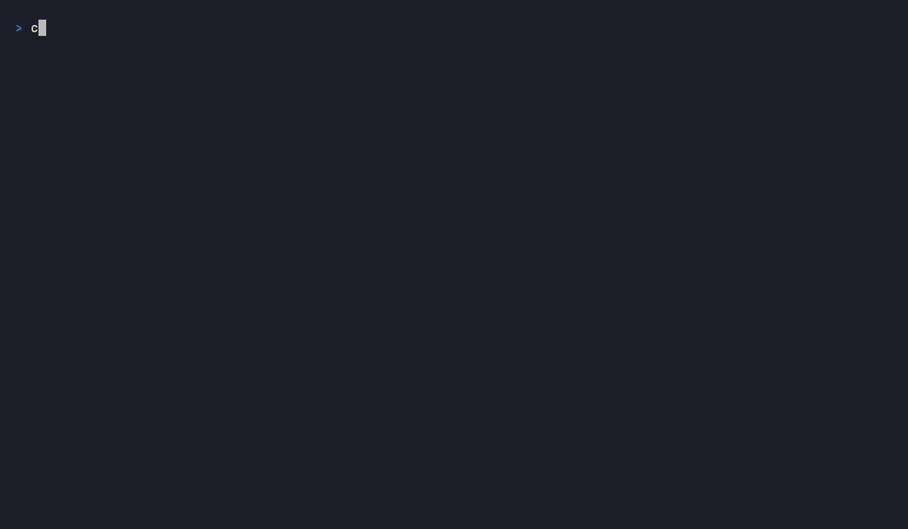
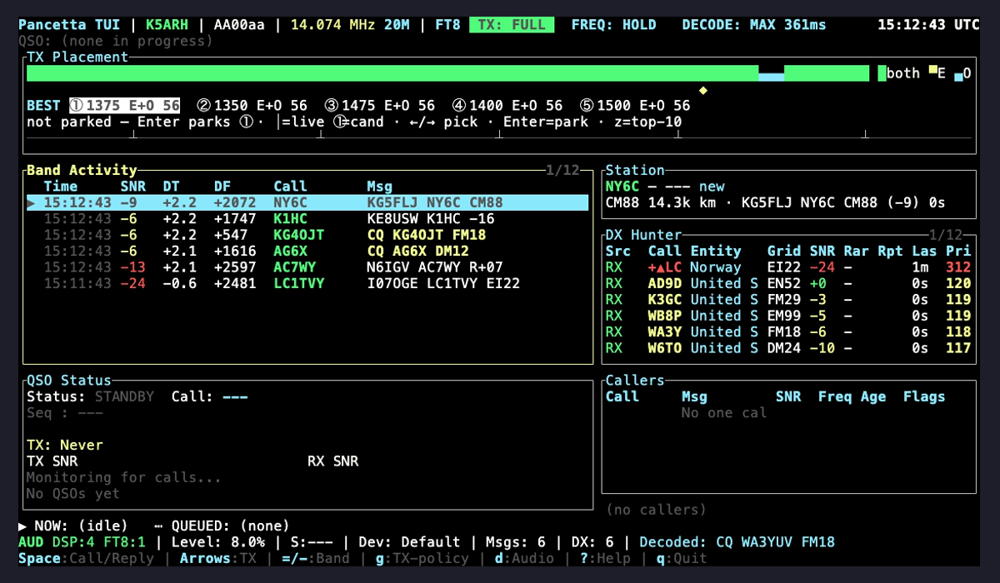
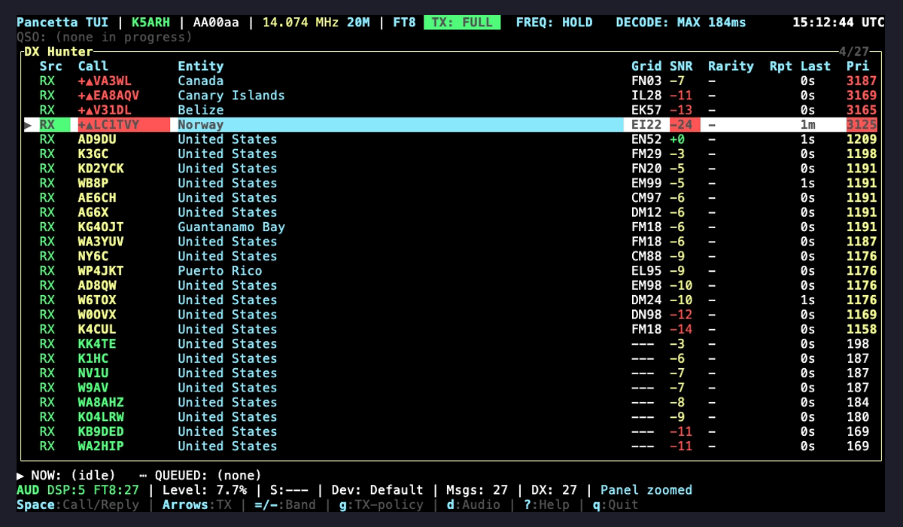
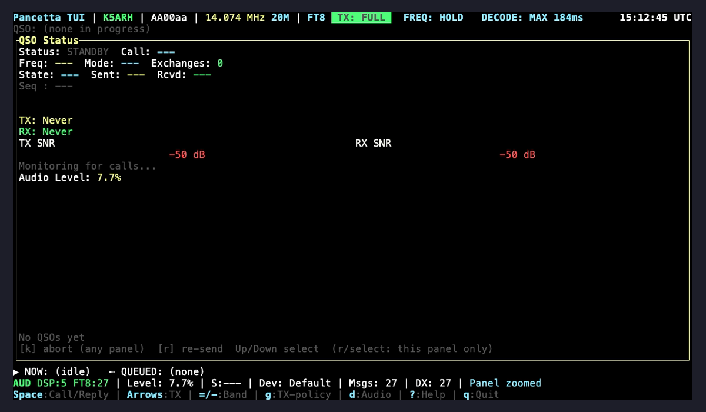
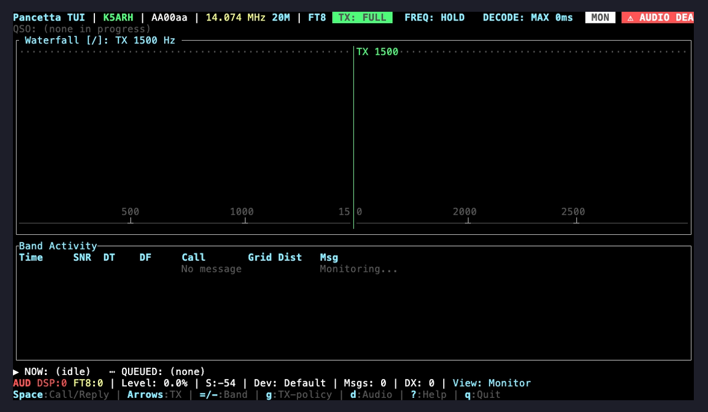
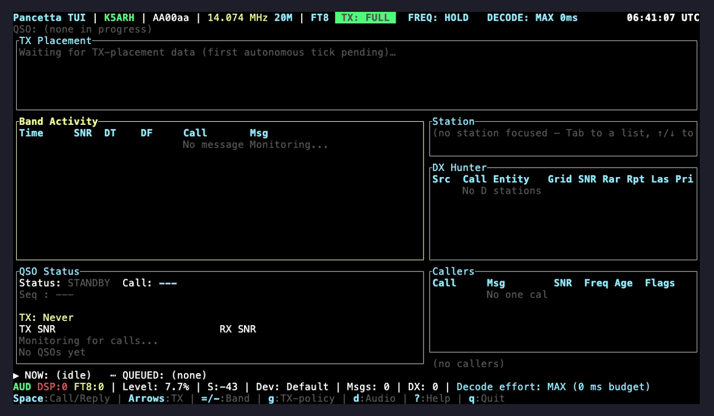

<p align="center">
  
</p>

<h1 align="center">Pancetta</h1>

<p align="center">
  A full FT8 station in one Rust binary — decode, score, work, log.<br>
  Built and operated by <strong>Tony Hagale, K5ARH</strong>.
</p>

<p align="center">
  <a href="https://github.com/HagaleTechnologies/pancetta/actions/workflows/ci.yml"></a>
  <a href="#license"></a>
</p>

Pancetta is an FT8 station that lives in your terminal.



*`pancetta --replay` feeding archived WAV captures through the real pipeline:
startup, band monitoring, the TX-placement scorer ranking candidate offsets,
a burst of real FT8 decodes filling Band Activity when the capture reaches
its decodable slot, and a clean self-shutdown when the recording ends. One
recording of one small corpus proves nothing about recall — for measured
decode performance see
[`docs/decoder-comparison.md`](docs/decoder-comparison.md).*

## The pitch

Operating FT8 seriously today means WSJT-X for the modem, a logger for the
log, GridTracker for what's needed, and a cluster client for spots — four
alt-tabbed windows, each with its own idea of what your station is doing.
Pancetta is one binary and one terminal: decode, priority scoring, QSO state
machine, DX cluster, PSKReporter, and logbook upload in a single process that
runs as happily over SSH on a headless box behind the radio as on a desktop.

## Why Pancetta

- **A decoder measured against the real reference.** Against WSJT-X's `jt9` —
  the decoder hams actually run — Pancetta needs **~2.1 dB more SNR** to
  reach 50% recall on FT8, and **~3.95 dB more on FT4, where it caps at 78%
  recall**, at a false-positive cost of 1 decode per 1,000 pure-noise
  recordings (0.1%). In short: competitive, not yet class-leading. (An older
  1,201-file comparison against `ft8_lib` showed +11.6% more decodes, but
  `ft8_lib` is not the bar operators care about.) Full numbers and caveats:
  [`docs/decoder-comparison.md`](docs/decoder-comparison.md).
- **A priority engine, not a list.** Every decoded CQ is scored against
  needed DXCC, needed grid, POTA/SOTA, rarity, signal, and recent activity —
  so the station you should work is the one at the top.
- **Multi-stream TX.** A smart frequency allocator places N simultaneous FT8
  signals inside one 15-second slot, each on its own audio offset, all on the
  same parity.
- **Headless by design.** `--headless` logs instead of drawing; the decoder
  is an *anytime* algorithm with a per-window budget that self-tunes to the
  host, so slow hardware degrades recall instead of falling over.
- **`pancetta doctor`.** One command checks config, clock vs. NTP, audio
  device and level, decoder, and `rigctld` — and prints the fix for each
  failure.

On-air TX has been validated end-to-end against a Yaesu FTdx10 (clean ALC,
PSKReporter spots across North America and Europe). ~295 FT8 tests cover
encode, decode, LDPC, CRC, and OSD.

<!-- TODO (maintainer): drop a PSKReporter map capture at assets/pskreporter.png
     and reference it here as on-air proof. Requires a real pskreporter.info
     session, so it could not be captured automatically. -->

## What it looks like

Every capture below — and the GIF further down, and the hero GIF above — was
recorded on a development host with `pancetta --replay`, feeding archived
off-air WAV captures through the real pipeline (see [`.tapes/`](.tapes/)).
Real audio, real decodes, real panels — no mockups. The corpus is one short
recording, so treat these as a tour of the interface, not a performance
claim.

| | |
|---|---|
|  |  |
| Operate overview: TX placement, band activity, QSO status, callers. | DX Hunter: the priority-scoring table (entity, grid, SNR, rarity, score). |
|  |  |
| QSO status: state machine, exchanges, TX/RX reports. | Monitor: the waterfall and the TX-frequency marker. |

Decode effort is a live control — press `e` to cycle presets and the status
chip follows:



| Preset | Behavior |
|---|---|
| `Auto` (default) | Budget derived from the auto-probed hardware tier. |
| `Eco` | Floor pass only — fastest, lowest recall. |
| `Standard` | A moderate per-window budget. |
| `Deep` | A generous budget — more passes/candidates, better recall. |
| `Max` | Runs every decode stage, still bounded by the coordinator's per-slot ceiling (2 s on FT8). |

Pin it at startup via `[decoder]` in `pancetta.toml`
([`docs/CONFIG.md`](docs/CONFIG.md)); `e` is the only *live* control. Full
keybinding reference: [`docs/KEYBINDINGS.md`](docs/KEYBINDINGS.md), or press
`?` in the TUI.

## Autonomy with a control operator present

Hands-off operation is opt-in (`[autonomous] enabled = true`) and assumes a
licensed control operator is at the keyboard and can stop it instantly:

- **`Shift+Q` is an emergency stop** — halts TX and switches autonomous off.
  It drops the runtime autonomy gate, and every TX item the engine produced
  for that cycle is discarded before it can be keyed.
- **Autonomous *initiation* requires a present operator.** Calling CQ or
  pouncing needs a console keypress within the last two minutes (FCC §97.221:
  a station with nobody at the control point may respond, not originate).
  Headless or idle, Pancetta drops to respond-only; QSOs already in progress
  still finish. Every autonomous TX item additionally has to clear the active
  `TxPolicy` (e.g. dry-run/listen-only modes).
- **The *remote*-TX arm gate fails closed.** Separate from the above, and
  specific to transmissions originated over the remote-operation protocol:
  a poisoned lock means no transmit, never a permissive fallback, and it ANDs
  under the active TX policy. It governs `TxOrigin::Remote` only — local and
  autonomous TX are gated by the mechanisms above.
- **Drop-stale-TX.** The TX worker re-checks QSO liveness at the last instant
  before PTT, so a frame for a QSO that just ended never goes out.
- **One parity, always.** Concurrent QSOs share a slot parity; Pancetta never
  transmits in sequential windows.

Regulatory notes, including FCC §97.221 automatic-control considerations:
[`docs/fcc-part97-compliance.md`](docs/fcc-part97-compliance.md).

## Quick start

**1. Dependencies.**

```bash
# Linux (Debian/Ubuntu):
sudo apt update
sudo apt install -y libasound2-dev libudev-dev libssl-dev pkg-config libhamlib-utils
# macOS:
brew install hamlib
curl https://sh.rustup.rs -sSf | sh
```

| Requirement | Linux | macOS | Windows |
|---|---|---|---|
| Rust toolchain | rustup → stable | rustup → stable | rustup → stable |
| Audio dev headers | `libasound2-dev`, `libudev-dev` | (built in) | (built in) |
| TLS | `libssl-dev`, `pkg-config` | (built in) | (built in) |
| Hamlib (CAT — optional, runtime-only) | `apt install libhamlib-utils` | `brew install hamlib` | hamlib Windows build |

Hamlib is only needed to key a radio, not to build or to decode.

**2. Build.** `--recursive` matters: without the submodule the build warns and
falls back to the Rust-only decode path. First build is 5–10 minutes.

```bash
git clone --recursive https://github.com/HagaleTechnologies/pancetta.git
cd pancetta
cargo build --release
```

**3. Configure.** The first run walks you through writing
`~/.pancetta/pancetta.toml` — callsign, grid, audio devices, rig. Every key
is documented in [`docs/CONFIG.md`](docs/CONFIG.md).

```bash
./target/release/pancetta        # first-run wizard
cargo install --path pancetta    # optional: put `pancetta` on PATH
```

**4. Run.** With `[rig.interface]` disabled (the default) this is decode-only
and cannot key the radio. Enable the rig interface for TX; see
[`docs/RUNBOOK.md`](docs/RUNBOOK.md) for the autonomous-QSO procedure.

```bash
cargo run --release -p pancetta
```

> **Put your real callsign in `station.callsign` before transmitting.**
> Pancetta refuses to call CQ as `NOCALL`/`N0CALL`, but it will transmit
> whatever else you give it — Part 97 is your responsibility, not the
> software's.

## Command-line tools

One binary, several subcommands (`pancetta <cmd> --help` for details):

| Command | What it does |
|---|---|
| `pancetta` | Run the station (TUI). First run launches the setup wizard. |
| `pancetta doctor` | Station health check with a printed fix per failure. |
| `pancetta setup` | Interactive station/audio/rig/PTT wizard. Safe to re-run. |
| `pancetta test-audio --list` | List audio devices exactly as pancetta sees them. |
| `pancetta test-rig` | Test the rig link; `--ptt` keys TX for 1 s (careful!). |
| `pancetta config --validate` | Validate config, non-zero on error (`--show`, `--generate`). |
| `pancetta export --output log.adi` | Export logged QSOs to ADIF. |
| `pancetta benchmark-decode <wav-or-dir>` | Native decoder vs. ft8_lib on WAV captures. |
| `pancetta --wav <file>` | Decode one 15-s WAV and exit (no audio hardware). |
| `pancetta --replay <wav-dir>` | Feed a directory of WAVs through the full TUI pipeline. |
| `pancetta --headless` | No TUI; logs to `~/.pancetta/logs/`. |

## Why not (yet)

Honest gaps, so you can judge whether it fits your station:

- **Pre-1.0.** Config keys, CLI surface, and on-disk formats can still change
  between releases.
- **Some integrations are scaffolded, not live.** `pancetta-hamlib`'s FFI
  bindings are done, but the project's own status table still calls the
  crate an integration stub; `pancetta-cqdx` awaits live API validation;
  LoTW/eQSL upload is scaffolded where ClubLog/QRZ/cqdx paths are live.
- **Platform coverage is narrow.** Developed on macOS (Apple Silicon), CI on
  Linux, deployed on a Windows 11 MiniPC. Pi-class ARM is a design target of
  the effort-budget work but unvalidated on real hardware, and there are no
  prebuilt binaries yet — you build from source.
- **One radio, well tested.** CAT/PTT is exercised against a Yaesu FTdx10.
  Other hamlib-supported rigs should work; nobody has proven it.
- **`pancetta-research`** is a local-only decoder harness, excluded from CI
  and unsupported.

## Building, testing, lint

```bash
cargo build --workspace
cargo test --workspace --features transmit
cargo test -p pancetta-hamlib --lib -- --test-threads=1   # deterministic mock rig
cargo test -p pancetta --test loopback_qso                # end-to-end encode→decode
cargo clippy --workspace --features transmit
cargo fmt --all -- --check
```

CI runs all of this per PR plus a macOS `cargo check` lane; `cargo deny check`
guards advisories and license drift. The 14-crate strictly layered workspace
is mapped in [`docs/ARCHITECTURE.md`](docs/ARCHITECTURE.md).

## Documentation

- [`docs/GUIDE.md`](docs/GUIDE.md) — **start here**: your first 5 minutes, your first QSO, how-do-I recipes.
- [`docs/CONFIG.md`](docs/CONFIG.md) — every config key, with examples and defaults.
- [`docs/TROUBLESHOOTING.md`](docs/TROUBLESHOOTING.md) — audio init, missing decodes, duplicate QSOs, `rigctld`.
- [`docs/ARCHITECTURE.md`](docs/ARCHITECTURE.md) — crate graph, data flow, key abstractions.
- [`docs/KEYBINDINGS.md`](docs/KEYBINDINGS.md) — every TUI binding.
- [`docs/RUNBOOK.md`](docs/RUNBOOK.md) — operating procedures, including the autonomous QSO loop.
- [`docs/decoder-comparison.md`](docs/decoder-comparison.md) — native decoder vs. ft8_lib, measured.
- [`docs/PROVENANCE.md`](docs/PROVENANCE.md) — licensing provenance and the clean-room firewall.
- [`FEATURES.md`](FEATURES.md) — capabilities and feature status.
- [`SECURITY.md`](SECURITY.md) — vulnerability reporting and known trade-offs.
- [`CONTRIBUTING.md`](CONTRIBUTING.md) — coding standards and contribution flow.
- [`CHANGELOG.md`](CHANGELOG.md) — release notes.

API docs: `cargo doc --workspace --no-deps --open`.

## Acknowledgments

- **Joe Taylor (K1JT) and Steve Franke (K9AN)** designed FT8 — the LDPC code,
  Costas sync arrays, modulation, and message schema this project implements,
  documented in [*The FT4 and FT8 Communication Protocols*](https://wsjt.sourceforge.io/FT4_FT8_QEX.pdf).
- **Kārlis Goba (YL3JG)** authored [`ft8_lib`](https://github.com/kgoba/ft8_lib),
  the MIT-licensed C implementation Pancetta vendors at
  `pancetta-ft8/vendor/ft8_lib/` and calls via FFI. Several algorithms in the
  native Rust decoder are ported from it (CRC-14, LDPC tables, Gray code
  mapping, sliding spectrogram, LLR normalization) and attributed in the
  source where they appear.
- **The WSJT-X project** (GPL) is the de-facto reference FT8 application.
  Pancetta does **not** link or vendor any WSJT-X source; it interoperates
  through the published protocol only.

Full third-party license text: [`THIRD-PARTY-NOTICES.md`](THIRD-PARTY-NOTICES.md).
Licensing provenance and the clean-room process: [`docs/PROVENANCE.md`](docs/PROVENANCE.md).

## License

Dual-licensed under your choice of:

- MIT — see [`LICENSE-MIT`](LICENSE-MIT)
- Apache 2.0 — see [`LICENSE-APACHE`](LICENSE-APACHE)

Contributions are accepted under the same dual-license terms unless
explicitly stated otherwise in the PR.
