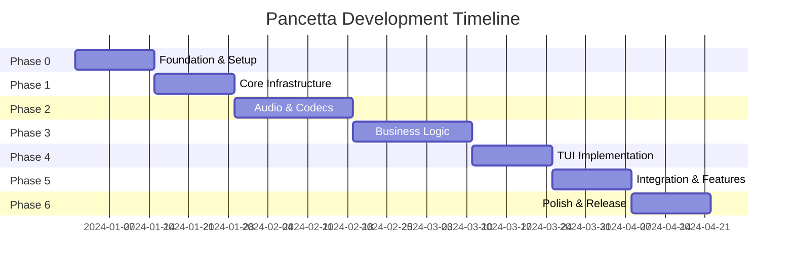

# Pancetta Implementation Plan

## Executive Summary

This document outlines a phased 16-week implementation plan for Pancetta, progressing from core infrastructure through to a fully-featured ham radio digital mode terminal. Each phase builds upon the previous, with comprehensive testing and documentation throughout.

## Development Phases Overview

## Phase 0: Foundation & Setup (Weeks 1-2)

### Objectives
Establish project structure, development environment, and core infrastructure.

### Tasks

#### Week 1: Project Setup
- [ ] Initialize Rust workspace structure
- [ ] Configure Cargo.toml with workspace members
- [ ] Set up Git repository with .gitignore
- [ ] Configure rustfmt and clippy rules
- [ ] Create CI/CD pipeline (GitHub Actions)
- [ ] Set up code coverage tracking
- [ ] Initialize documentation structure
- [ ] Create development environment setup scripts

#### Week 2: Core Architecture
- [ ] Implement dependency injection container
- [ ] Create event bus infrastructure
- [ ] Set up structured logging with tracing
- [ ] Implement error handling framework
- [ ] Create configuration management system
- [ ] Set up feature flags system
- [ ] Implement basic telemetry collection
- [ ] Create development CLI tools

### Deliverables
- Working Rust project structure
- CI/CD pipeline running tests
- Basic architectural components
- Development environment documentation

### Success Criteria
- [ ] Project compiles without warnings
- [ ] CI pipeline passes on all platforms
- [ ] Logging system operational
- [ ] Configuration loading working

---

## Phase 1: Core Infrastructure (Weeks 3-4)

### Objectives
Build the foundational infrastructure layer components.

### Tasks

#### Week 3: Data Layer
- [ ] Set up SQLite with sqlx
- [ ] Implement repository pattern interfaces
- [ ] Create database migrations system
- [ ] Implement contact repository
- [ ] Implement QSO repository
- [ ] Create backup/restore functionality
- [ ] Add database connection pooling
- [ ] Implement transaction support

#### Week 4: Domain Models
- [ ] Define core domain entities
- [ ] Implement Callsign type with validation
- [ ] Implement GridSquare type with calculations
- [ ] Create Frequency type with band validation
- [ ] Implement DXCC entity lookups
- [ ] Create QSO state machine
- [ ] Implement message types
- [ ] Add domain event definitions

### Deliverables
- Complete data persistence layer
- Domain model implementations
- Repository pattern implementations
- Database schema migrations

### Success Criteria
- [ ] All domain models have 100% test coverage
- [ ] Database operations are async
- [ ] Repository tests pass
- [ ] Domain validations working

---

## Phase 2: Audio & Codecs (Weeks 5-7)

### Objectives
Implement audio I/O and digital mode codecs.

### Tasks

#### Week 5: Audio Infrastructure
- [ ] Integrate cpal for audio I/O
- [ ] Implement audio device enumeration
- [ ] Create audio stream management
- [ ] Implement ring buffer for samples
- [ ] Add sample rate conversion
- [ ] Create audio level monitoring
- [ ] Implement AGC algorithm
- [ ] Add audio device hot-plug support

#### Week 6: FT8 Codec
- [ ] Port ft8_lib to Rust or create FFI bindings
- [ ] Implement FT8 decoder
- [ ] Implement FT8 encoder
- [ ] Create message parser
- [ ] Add time synchronization check
- [ ] Implement decode confidence scoring
- [ ] Create test suite with known signals
- [ ] Benchmark decode performance

#### Week 7: Codec Framework
- [ ] Create codec trait abstraction
- [ ] Implement codec plugin system
- [ ] Add FT4 codec support
- [ ] Create codec configuration system
- [ ] Implement parallel decoding
- [ ] Add decode result caching
- [ ] Create codec performance metrics
- [ ] Document codec API

### Deliverables
- Working audio I/O system
- FT8/FT4 encode/decode capability
- Codec plugin architecture
- Performance benchmarks

### Success Criteria
- [ ] Audio capture/playback working on all platforms
- [ ] FT8 decode accuracy > 95%
- [ ] Decode time < 100ms
- [ ] Memory usage < 50MB during decode

---

## Phase 3: Business Logic (Weeks 8-10)

### Objectives
Implement core ham radio operational logic.

### Tasks

#### Week 8: QSO Management
- [ ] Implement QSO state machine
- [ ] Create message sequencing logic
- [ ] Add automatic response generation
- [ ] Implement manual override system
- [ ] Create QSO timing management
- [ ] Add duplicate detection
- [ ] Implement QSO validation rules
- [ ] Create QSO history tracking

#### Week 9: DX Hunter Engine
- [ ] Implement DXCC detection
- [ ] Create rarity scoring algorithm
- [ ] Add worked/confirmed tracking
- [ ] Implement band/mode new one detection
- [ ] Create priority queue management
- [ ] Add automatic calling logic
- [ ] Implement DX cluster integration
- [ ] Create statistical analysis

#### Week 10: Hamlib Integration
- [ ] Create hamlib-sys FFI bindings
- [ ] Implement safe Rust wrapper
- [ ] Add rig capability detection
- [ ] Create frequency/mode control
- [ ] Implement PTT control methods
- [ ] Add rig status monitoring
- [ ] Create rig profile system
- [ ] Test with virtual rigs

### Deliverables
- Complete QSO management system
- DX hunting engine
- Hamlib integration layer
- Rig control abstraction

### Success Criteria
- [ ] QSO state machine handles all standard exchanges
- [ ] DX scoring algorithm produces correct results
- [ ] Hamlib controls test rig successfully
- [ ] PTT timing accurate to 10ms

---

## Phase 4: TUI Implementation (Weeks 11-12)

### Objectives
Build the terminal user interface using Ratatui.

### Tasks

#### Week 11: UI Framework
- [ ] Set up Ratatui with crossterm
- [ ] Create application state management
- [ ] Implement layout system
- [ ] Create widget library
- [ ] Add keyboard event handling
- [ ] Implement command palette
- [ ] Create help system
- [ ] Add theme support

#### Week 12: UI Components
- [ ] Implement band activity display
- [ ] Create QSO status panel
- [ ] Add DX hunter display
- [ ] Implement station info panel
- [ ] Create configuration screens
- [ ] Add log viewer
- [ ] Implement message composer
- [ ] Create status bar

### Deliverables
- Complete TUI implementation
- All UI components functional
- Keyboard navigation working
- Help documentation

### Success Criteria
- [ ] UI updates at 60 FPS
- [ ] No UI freezing during decode
- [ ] All functions keyboard accessible
- [ ] Responsive to window resize

---

## Phase 5: Integration & Features (Weeks 13-14)

### Objectives
Integrate all components and add advanced features.

### Tasks

#### Week 13: System Integration
- [ ] Wire up audio to codec pipeline
- [ ] Connect codec to QSO manager
- [ ] Integrate DX hunter with UI
- [ ] Connect hamlib to UI controls
- [ ] Implement end-to-end message flow
- [ ] Add system health monitoring
- [ ] Create integration test suite
- [ ] Performance optimization pass

#### Week 14: Advanced Features
- [ ] Implement PSKReporter client
- [ ] Add QRZ.com API integration
- [ ] Create ADIF export/import
- [ ] Implement band hopping
- [ ] Add macro system
- [ ] Create alert system
- [ ] Implement auto-logging
- [ ] Add contest mode basics

### Deliverables
- Fully integrated application
- External service integrations
- Advanced operational features
- Integration test suite

### Success Criteria
- [ ] Complete QSO from CQ to 73
- [ ] PSKReporter spots visible online
- [ ] ADIF import/export working
- [ ] 24-hour stability test passes

---

## Phase 6: Polish & Release (Weeks 15-16)

### Objectives
Finalize application for v1.0 release.

### Tasks

#### Week 15: Quality Assurance
- [ ] Complete test coverage to 80%
- [ ] Fix all clippy warnings
- [ ] Resolve all TODO items
- [ ] Update all documentation
- [ ] Create user manual
- [ ] Record demo videos
- [ ] Beta testing program
- [ ] Bug fixes from testing

#### Week 16: Release Preparation
- [ ] Create release binaries for all platforms
- [ ] Set up package distribution
- [ ] Generate API documentation
- [ ] Create installation guides
- [ ] Prepare release notes
- [ ] Set up project website
- [ ] Create community channels
- [ ] Launch announcement preparation

### Deliverables
- Release-ready binaries
- Complete documentation
- Distribution packages
- Marketing materials

### Success Criteria
- [ ] Zero critical bugs
- [ ] Documentation complete
- [ ] Installers work on all platforms
- [ ] Beta tester approval

---

## Risk Management

### Technical Risks

| Risk | Probability | Impact | Mitigation |
|------|------------|--------|------------|
| FT8 codec complexity | Medium | High | Use existing ft8_lib, FFI if needed |
| Audio latency issues | Low | High | Use proven cpal library, optimize buffers |
| Hamlib compatibility | Medium | Medium | Test early, provide manual fallback |
| Cross-platform bugs | Medium | Medium | CI testing on all platforms |
| Performance problems | Low | High | Continuous benchmarking, profiling |

### Schedule Risks

| Risk | Probability | Impact | Mitigation |
|------|------------|--------|------------|
| Scope creep | High | Medium | Strict MVP definition, defer features |
| Integration delays | Medium | Medium | Early integration testing |
| Testing discoveries | Medium | Low | Buffer time in schedule |
| Dependency issues | Low | Medium | Vendor critical dependencies |

---

## Resource Requirements

### Development Team

| Role | Phase 0-1 | Phase 2-3 | Phase 4-5 | Phase 6 |
|------|-----------|-----------|-----------|---------|
| Backend Developer | 100% | 80% | 40% | 20% |
| Frontend Developer | 20% | 20% | 100% | 40% |
| DevOps Engineer | 80% | 20% | 20% | 80% |
| QA Engineer | 20% | 40% | 60% | 100% |
| Technical Writer | 10% | 20% | 30% | 80% |

### Infrastructure

- **Development**: Local machines with Rust toolchain
- **CI/CD**: GitHub Actions (free tier sufficient)
- **Testing**: Virtual audio devices, hamlib dummy rig
- **Distribution**: GitHub Releases, package repositories

---

## Testing Strategy Per Phase

### Phase 0-1: Foundation
- Unit tests for all utilities
- Integration tests for database
- Property tests for domain models

### Phase 2: Audio & Codecs
- Unit tests for DSP functions
- Integration tests with test audio files
- Performance benchmarks
- Fuzz testing for codec

### Phase 3: Business Logic
- Unit tests for state machines
- Integration tests for hamlib
- Scenario tests for QSOs
- Mock rig testing

### Phase 4: TUI
- Component rendering tests
- Event handling tests
- Layout regression tests
- Accessibility validation

### Phase 5: Integration
- End-to-end test scenarios
- Load testing
- Network failure testing
- 24-hour stability test

### Phase 6: Release
- User acceptance testing
- Beta testing program
- Platform compatibility testing
- Installation testing

---

## Definition of Done

### Code Complete
- [ ] Feature implemented and working
- [ ] Unit tests written and passing
- [ ] Integration tests where applicable
- [ ] Documentation updated
- [ ] Code review completed
- [ ] No compiler warnings
- [ ] Clippy warnings resolved

### Feature Complete
- [ ] Acceptance criteria met
- [ ] Edge cases handled
- [ ] Error messages user-friendly
- [ ] Performance acceptable
- [ ] Telemetry added

### Release Ready
- [ ] All tests passing
- [ ] Documentation complete
- [ ] Binaries built for all platforms
- [ ] Release notes written
- [ ] Version tagged

---

## Success Metrics

### Performance Targets
- Audio latency: < 50ms
- FT8 decode time: < 100ms
- UI frame rate: 60 FPS
- Memory usage: < 100MB
- CPU usage idle: < 5%
- CPU usage active: < 30%

### Quality Targets
- Test coverage: > 80%
- Crash rate: < 0.1%
- Bug discovery rate: < 5 per week
- User satisfaction: > 4.5/5

### Adoption Targets
- Week 1: 100 downloads
- Month 1: 1,000 users
- Month 3: 5,000 users
- Month 6: 10,000 users

---

## Post-Launch Roadmap

### Version 1.1 (Month 2)
- Additional digital modes (JS8, PSK31)
- Waterfall display option
- Enhanced DX features

### Version 1.2 (Month 4)
- Web UI beta
- Cloud backup option
- Contest mode enhancements

### Version 2.0 (Month 6)
- Mobile companion app
- Remote operation
- Multi-user support

---

## Conclusion

This implementation plan provides a structured approach to building Pancetta with clear phases, deliverables, and success criteria. The 16-week timeline balances development velocity with quality, ensuring a robust and feature-complete v1.0 release.

The phased approach allows for:
- Early validation of technical choices
- Continuous integration and testing
- Regular milestone deliveries
- Risk mitigation through incremental development
- Flexibility to adjust based on discoveries

Following this plan will result in a modern, well-architected ham radio application ready for community adoption and future expansion.